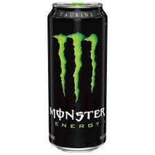

# Monster
---
## Why monster is the best drink
* Both the regular and low-calorie versions of Monster Energy drink are a good source of four out of the eight B vitamins. 
* One serving meets 100 percent of the daily value for vitamin B-12, riboflavin, niacin and vitamin B-6.

